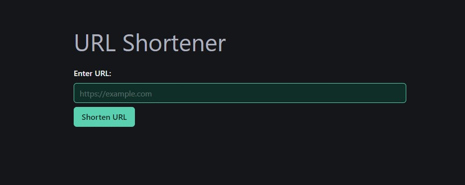

# shorturl

Service to create short urls



## What's under the hood

- python 3.12
- fastapi
- htmx
- pytest
- Bulma

## Getting Started

**Create virtual environment**

```sh
make venv
```

**Install dependencies**

```sh
make install-deps
```

**Initialize database**

```sh
make init_db
```

**Start the server**

```sh
make start
```

### Development

**Start development server with reload**

```sh
make dev
```

### Testing

**Run tests**

```sh
make test
```
